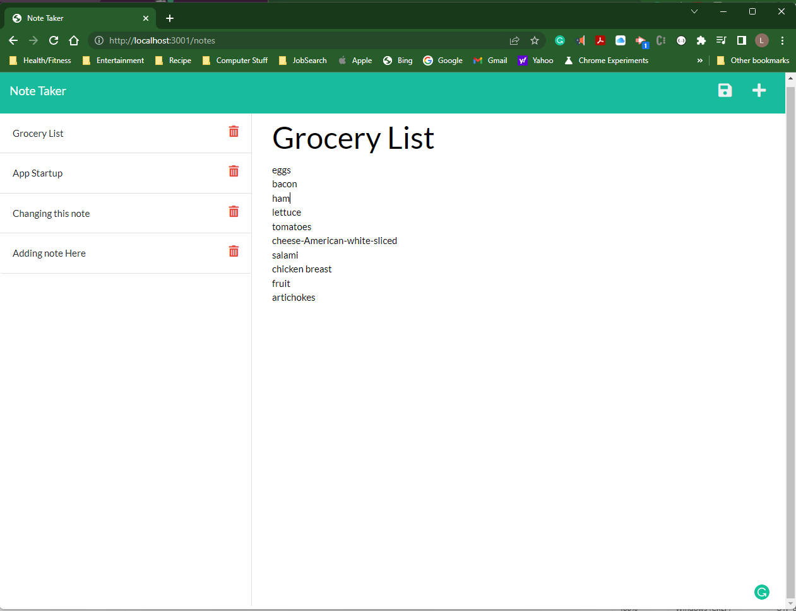

# MOD11-C-Note-Taker 
--- Server-side Storage of Note Taker 

[](https://opensource.org/licenses/MIT)

## Description
Note Taker gives you a place to keep your notes . You can also update or delete notes you have previously saved.


## Table of Contents
  
- [Installation](#installation)
- [Usage](#usage)
- [Credits](#credits)
- [License](#license)
- [Feature](#features)
- [How to Contribute](#contribute)
- [How to Test](#test)
- [Contact Info](#contact)

## Installation

1. Type ```npm init -y``` to initialize npm to produce the package.json file.
2. Type ```npm install express``` to express modules.
3. Type ```node index``` to run.


## Usage
JavaScript,JavaScript with Node.js,HTML with CSS, npm express routers, HTTP Methods
    

## Credits

I was given starter code that hade most of the html and css done. The project was for the express router setup and the CRUD  HTTP Methods.

## License

This application is using the The MIT License License. Click on the badge  [](https://opensource.org/licenses/MIT)  to follow the link to the license.

---

## Features

Modular routes, HTTP methods

## How to Contribute

This application follows the [Contributor Covenant](https://www.contributor-covenant.org/).

If you would like to contribute it, you can create an issue on GitHub repository at https://github.com/LRicciardo/MOD11-C-Note-Taker. 

## Tests


  
## Contact Info

This application follows the [Contributor Covenant](https://www.contributor-covenant.org/).

If you would like to contact me about an issue, you can send an email to Liane.Ricciardo@gmail.com.

